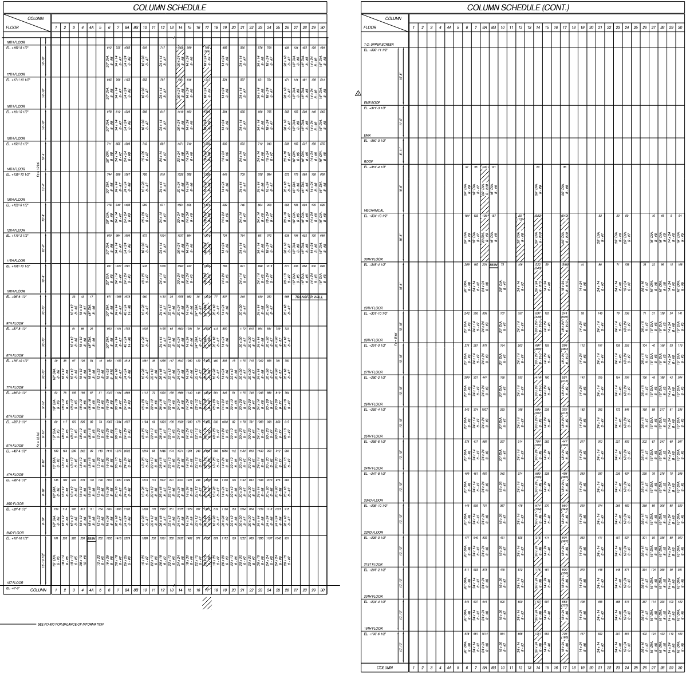
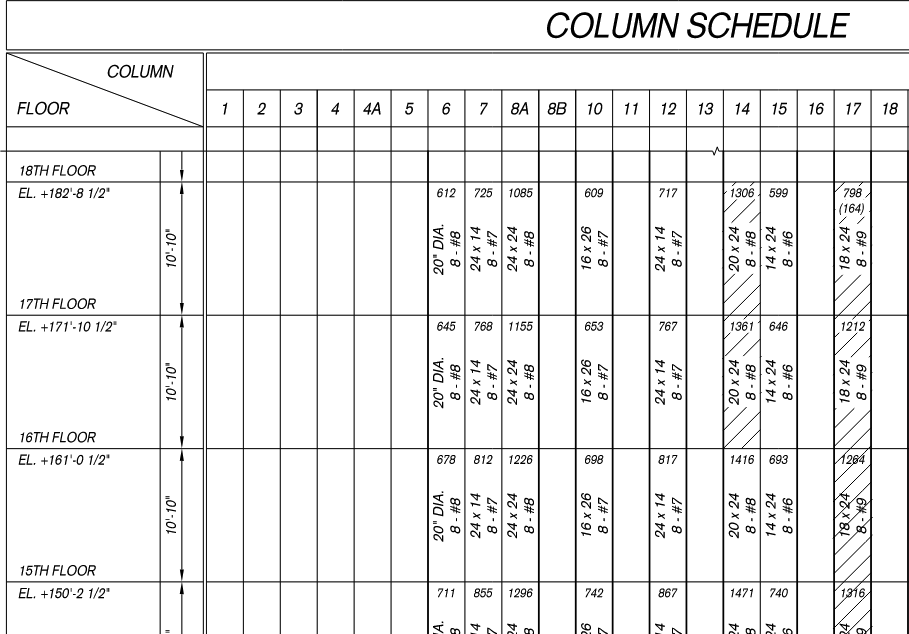
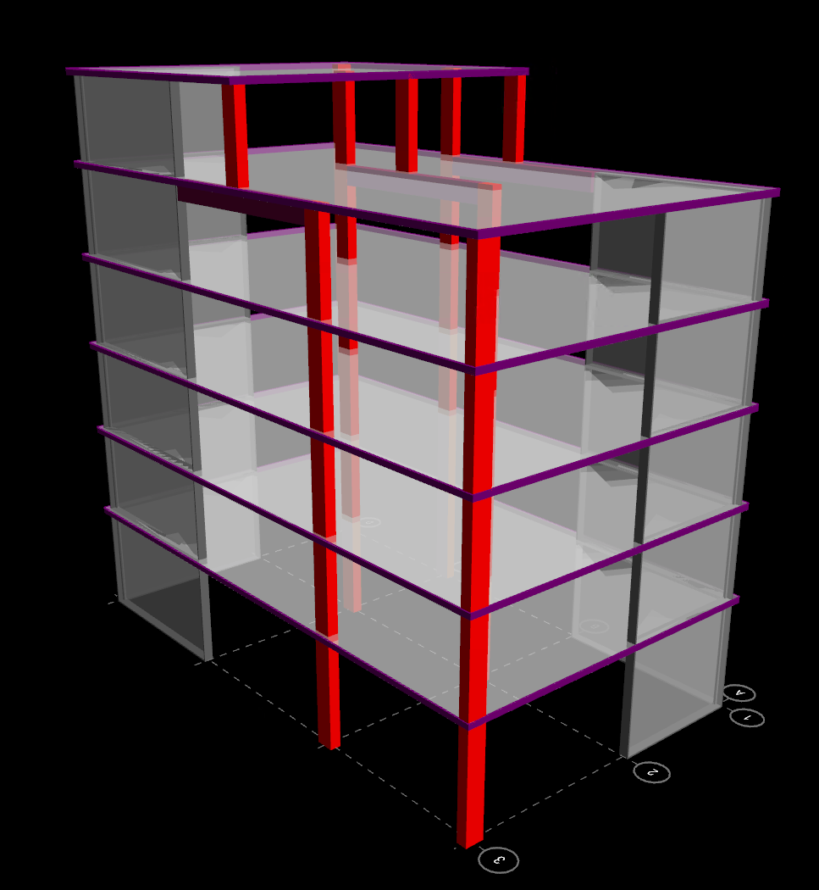
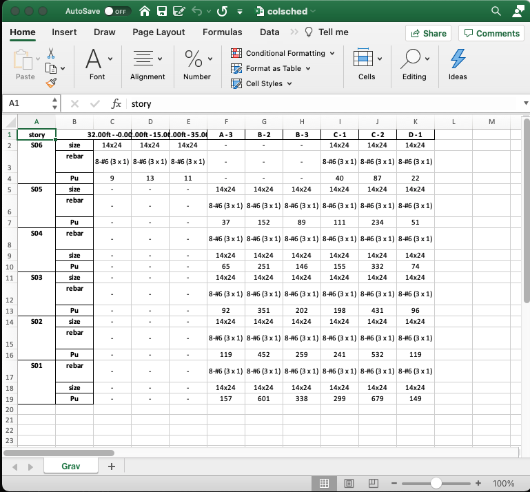

# FINAL PROJECT: Column Schedule Automation

## Context
I am a structural engineer in NYC, and I took this course to look for opportunities
in my day-to-day to automate mundane tasks at work. 

For my final project, I created a way to automate the creation of a _column schedule_. 

For each column in a building, structural engineers are required to document:
1. the load to the columns (generally in kips, where 1 kip = 1000 lbs)
2. the reinforcement required in the column
3. the size of the column

The aggregation of this information (among other things) is called a column schedule. Each cell in the schedule below represents a single column from one story to the next.

Column schedule example:

Zoomed in:

Currently, an engineer must generate these schedules by hand from the structural models. As you can see, for a building with hundreds of columns, this can be a cumbersome task and creates a possibility for human error.

RAM Structural Systems 3D model example:

This course has given me to the tools to automate such processes.

## Introducing my final project

### Steps:
1. extract raw data from structural model
    * one part comes in the form of a .db file
    * the other part comes in the form of a .csv file
2. perform SQL query on .db file
    * the .db file contains two tables
    * perform a join on relevant values
3. import csv file and .db files into main python file
    * merge the two into a DataFrame from the python pandas package
4. manipulate and clean up DataFrame to achieve desired format
    * pivot tables
    * stacks
5. write final DataFrame to Excel using openpyxl package
6. final touches:
    * to make this program a bit more dynamic, I added some simple UI to prompt the user to select their .db and csv files
    * once the program is run, the user will again be prompted to name and save the output in a directory of their choice.
    * this was done using the tkinter package

### Final Product

## Looking forward
This project is specific to structral models using Bentley's RAM Structural Systems. I imagine that a similar program could be written for other structural modelling programs, as most structural software have the capability to produce post-processed data (though some hefty data cleaning may be involved).

The creation of a column schedule for an engineer can vary from half a day to a full day. Using this program would greatly reduce the hours and human errors in the creation of a column schedule. I would approximate a 75% reduction. If, office wide, 100 column schedules are generated per year, and it takes an average of 6 hours to create, the gained efficiency would be 450 hours per annum (or approximately 11 weeks worth of work using a 40 hour work week). In the context of a single project, it would take me about 5 minutes to extract the data and run my program, whereas before, it would take me an average of 4 hours to complete (i.e. I have become 98% more efficient at this task).

I will still need to run some validation on this program for a couple of corner cases (sloping columns, columns with different load combinations). Once validation is complete, my intent is to make this into an executable file such that anyone in my office will be able to utilize this tool.
